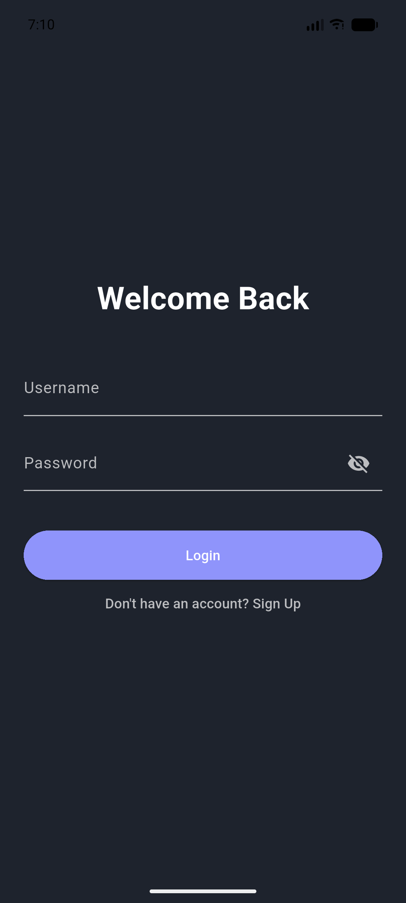
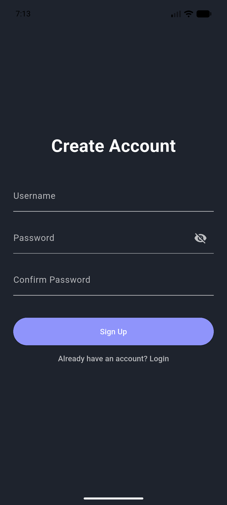
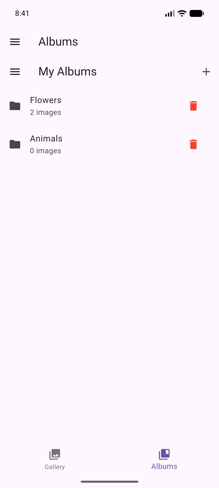

# ImageHub Project

Welcome to the **ImageHub Project**!

ImageHub is a full-stack image management and sharing application featuring a **Java** backend and a **Flutter** frontend. The project implements a client-server architecture, where the Flutter application communicates with the Java server via TCP socket connections and JSON-formatted messages.

The application empowers users to create accounts, upload images, organize them into albums, interact socially through likes and comments, and manage their collections efficiently.

---

## 🏗️ Project Architecture

The system is composed of three primary layers:

### Backend (Java Server)
A high-performance, socket-based server responsible for:
- Managing client connections and concurrency.
- User authentication and authorization.
- CRUD operations for images and albums.
- Real-time social interaction processing (likes/comments).
- Data persistence using JSON serialization.

### Model & Service Layers
- **Models:** Core entities including `User`, `Admin`, `Image`, `Album`, and `Comment`.
- **Services:** Business logic encapsulated in `UserService`, `ImageService`, `AlbumService`, and `AdminService`.

### Frontend (Flutter)
A modern, responsive UI built with Dart:
- Handles user registration, login, and session persistence.
- Provides image browsing, uploading, and album management.
- Communicates seamlessly with the backend via TCP sockets.

---

## 💾 Database Strategy
ImageHub utilizes a lightweight JSON-based storage system, managed via the **Gson** library:

* **UsersDatabase.json:** Stores user profiles, credentials, uploaded image references, and admin status[cite: 3].
* **ImagesDatabase.json:** Stores comprehensive image metadata (title, caption, uploader, tags, like counts, and comments)[cite: 3].

---

## 🚀 Key Features

### User & Admin Management
- **Security:** Secure password validation and session management using `Shared Preferences`.
- **Admin Control:** Administrators can ban/unban users and monitor system statistics.

### Image & Social Interaction
- **Uploads:** Direct uploading from device gallery with title, caption, and tag support.
- **Social:** Interactive liking and commenting system for enhanced user engagement.
- **Albums:** Organize, move, and manage images across custom albums.

---

## 🛠️ Tech Stack

| Layer | Technologies |
| :--- | :--- |
| **Backend** | Java, Gson, TCP Sockets |
| **Frontend** | Flutter, Dart, Material Design |
| **Key Packages** | `shared_preferences`, `image_picker`, `animate_do`, `flutter_staggered_grid_view` |

---

## 📱 Screenshots

| Login Page | Sign Up Page | Home Page |
| :---: | :---: | :---: |
|  |  |  |

| Navigation Drawer | Albums Page | Album Details |
| :---: | :---: | :---: |
|  |  |  |

| Image Details | | |
| :---: | :---: | :---: |
|  | | |

---

## ⚙️ How To Run

### Backend
1. Open the project in your Java IDE.
2. Ensure the **Gson** dependency is added.
3. Run the Java server (default port: **8085**).

### Flutter Frontend
1. Install dependencies:
   ```bash
   flutter pub get
